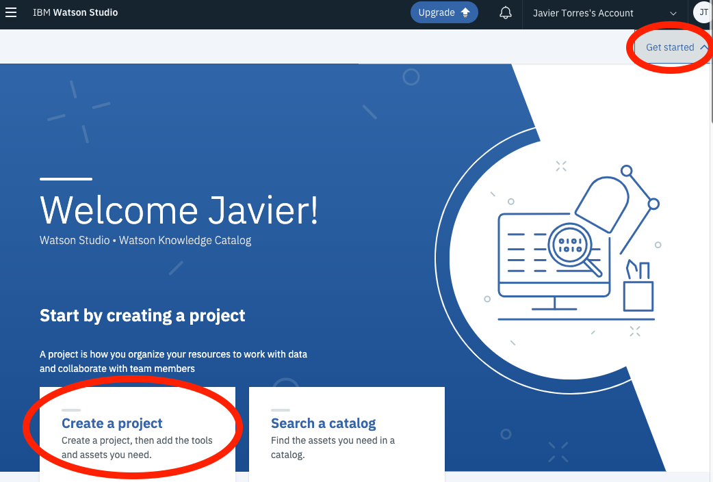
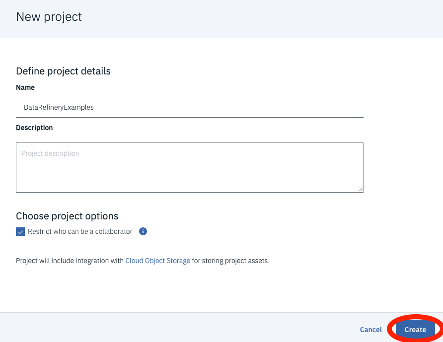
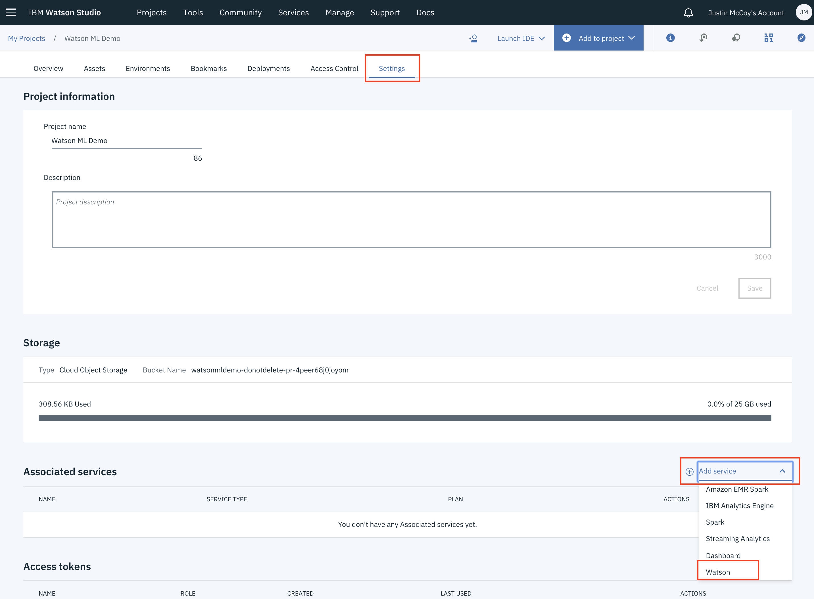
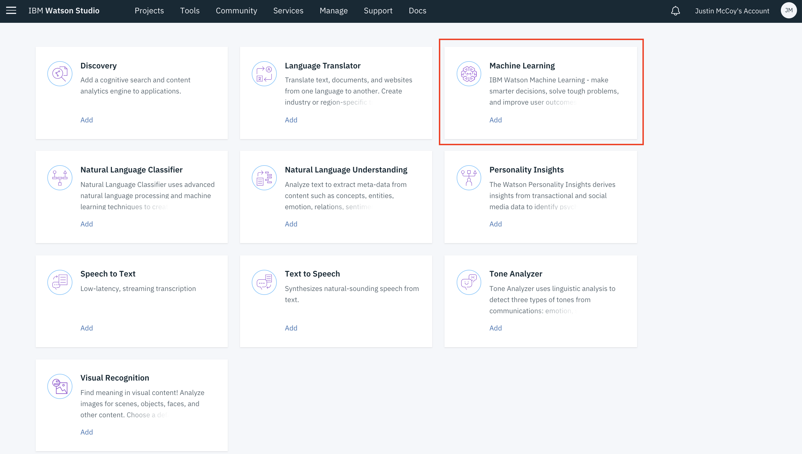
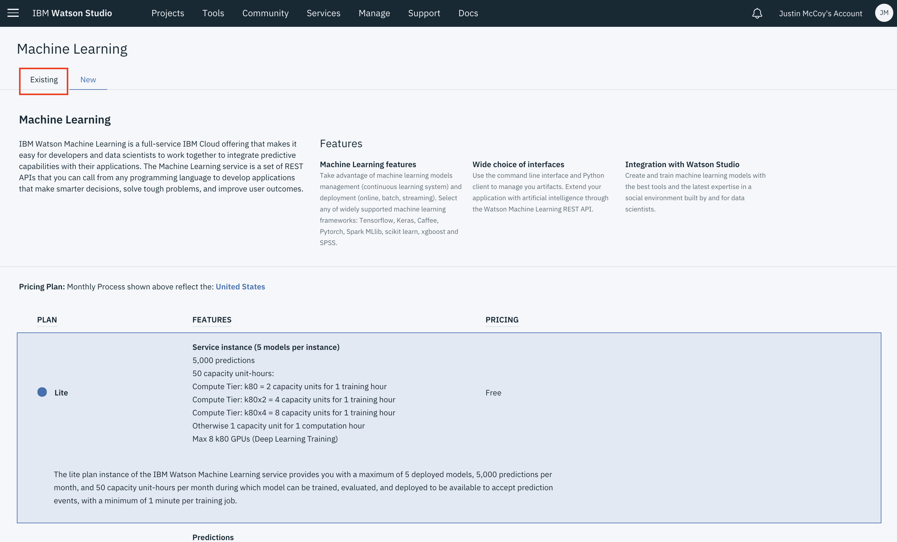
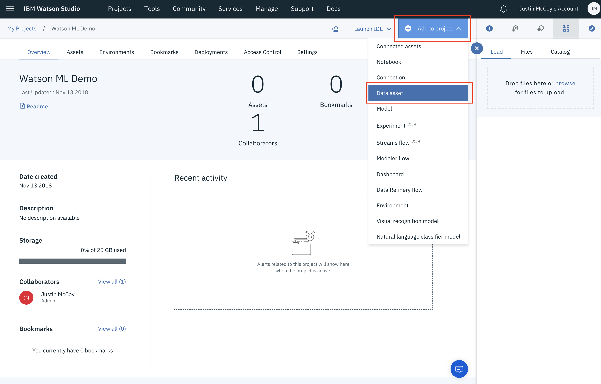
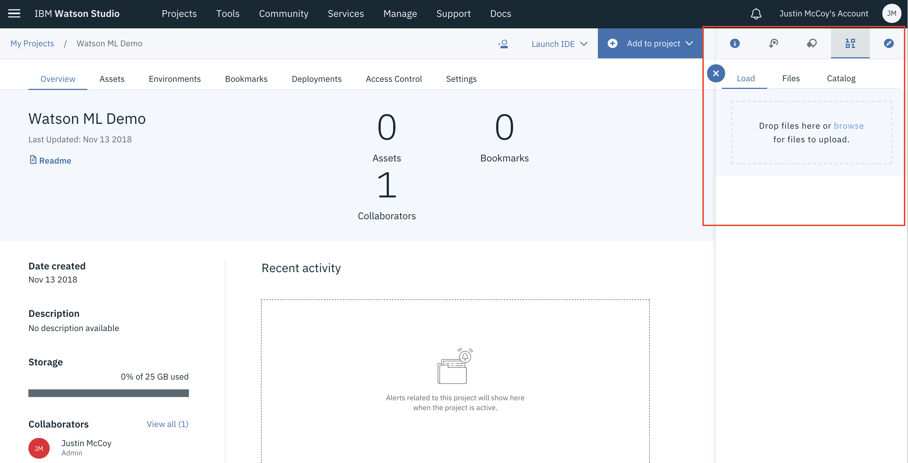
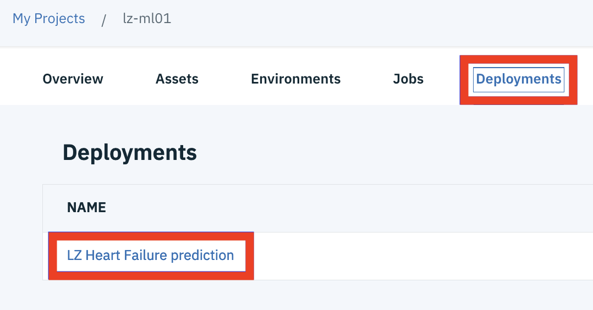
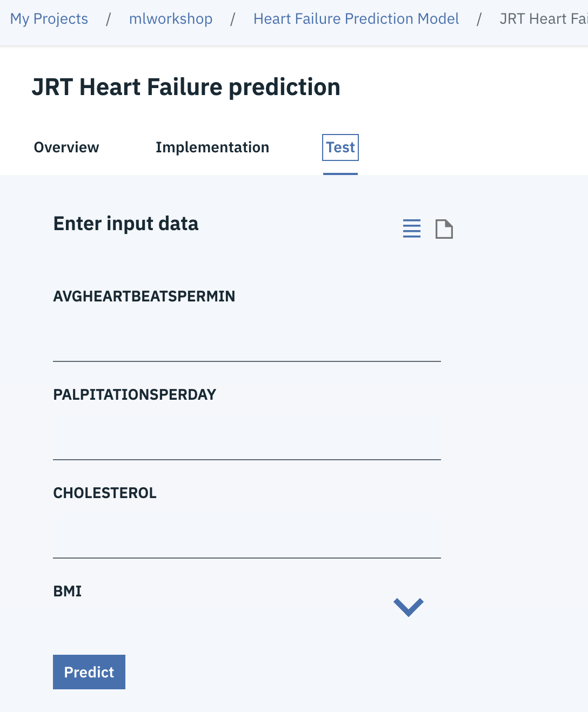

# Build and Deploy an ML model using AutoAI

In this walkthrough we will be building a model using a fully automated capability of Watson Studio and Watson Machine Learning known as Auto AI. To do this we will:

- Create a project in Watson Studio.
- Add dataset to project.
- Use the AutoAI Experiment.

## Included components

- [IBM Watson Studio](https://www.ibm.com/cloud/watson-studio): Analyze data using RStudio, Jupyter, and Python in a configured, collaborative environment that includes IBM value-adds, such as managed Spark.

### Prerequisites

- The data and Jupyter notebooks used in these labs are contained in this repository. Ensure you have downloaded / cloned the repository per instructions in the [README](READMe.md).

- It is assumed you have your environment set up with either lite or payed versions of Watson Studio and Watson Machine Learning. If not, contact the lab instructor or set up your own lite instances as detailed in the [Setup Environment readme](EnvironmentSetup.md)

## Step 1: Setup Project

1. Open Watson Studio by logging in at [https://dataplatform.ibm.com](https://dataplatform.ibm.com)

1. From the dashboard page, Click the **`Get started`** drop down menu on the top right of the page and then Click on the **`Create a project`** option to create a new project on Watson Studio.

    

1. Select `Standard` as the type of project to create.

1. Give your project a name and click **`Create`** on the bottom right.

    

1. Next we have to associate a Watson Machine Learning service to the project. Click on `Settings` on the top banner of the project, then `Add Service` under `Associate Services` and finally, select `Watson` to add a Watson service to the project.

    

1. Select `Machine Learning` from the list of available Watson Services.

    

1. Click on the `Existing` tab and select the name of your Machine Learning service instance.

    
  
1. The Watson Machine Learning service is now listed as one of your `Associated Services`.

## Step 2: Add Data Set

1. Click the `Assets` tab of the project near the top of the page. Then click `Add to project` on the top right, selecting `Data`.

    

    A panel on the right of the screen appears, select `Load` and click on `Browse` to upload the data file you'll use to create a predictive model.

    

1. On your machine, browse to the location of the file **patientdataV6.csv** in this repository in the **data/** directory. Select the file and click on Open (or the equivalent action for your operating system). Once successfully uploaded, the file should appear in the `Data Assets` section of `Assets`.

## Step 3: Build Modeler Flow

TBD

## [Optional] Step 4: Deploy the Machine Learning model

Although training is a critical step in the machine learning process, the model still needs to be packaged, fronted with an API, and deployed as a web service. Watson Machine Learning streamlines deployment of machine learning models into production.

1. Starting from projects page in Watson Studio, you should see an additional asset has been added to the project. The newly trained and saved model you created above should be visible. One easy way to tell it was created by the automated model builder is the type will be type wml.

1. Select the model from the project view, then select `Deployments` from the model view, and finally select `Add Deployment`.

1. Name the deployment something unique and click `Save`.

1. The model is quickly packaged and deployed. Upon completion you will have a new deployment of the trained machine learning model; every trained model can have many deployments.

## [Optional] Step 5: Test the Model

1. Aside from testing the model within the notebook. You can test the model using the Watson Studio Interface.

1. Click on the `Deployment` tab on the top of the project page and then click the name you used to create the deployment of your model

   

1. Enter some values in the form and click the `Predict` button.

   
