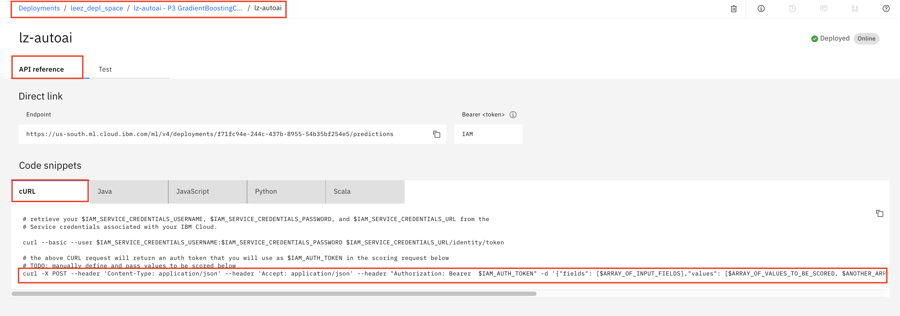

# Build and Deploy an ML model using AutoAI

In this walkthrough we will be building a model using a fully automated capability of Watson Studio and Watson Machine Learning known as Auto AI. 

AutoAI automates the pipeline optimization process that is common to the model development workflow. As part of that optimization process, AutoAI will perform the following:

- Data pre-processing: AutoAI attempts to analyze, clean, and prepare your raw data for machine learning. Automatically detects and categorizes features based on data type and finds best  strategies for missing value imputation, feature encoding, and feature scaling for your data.

- Automated model selection: AutoAI performs testing and ranking of candidate estimators against small subsets of the data set, gradually increasing the size of the subset for the most promising estimators to arrive at the best match.

- Automated feature engineering: Feature engineering attempts to transform the raw data into the combination of features that best represents the problem to achieve the most accurate prediction.

- Hyperparameter optimization: A hyper-parameter optimization step refines the best performing model pipelines.

In the lab we will:

- Create a project in Watson Studio.
- Add dataset to project.
- Use the AutoAI Experiment.

## Included components

- [IBM Watson Studio](https://www.ibm.com/cloud/watson-studio): Analyze data using RStudio, Jupyter, and Python in a configured, collaborative environment that includes IBM value-adds, such as managed Spark.

### Prerequisites

- The data used in these labs are contained in this repository. Ensure you have downloaded / cloned the repository per instructions in the [README](READMe.md).

- It is assumed you have your environment set up with either lite or payed versions of Watson Studio and Watson Machine Learning. If not, contact the lab instructor or set up your own lite instances as detailed in the [Setup Environment readme](EnvironmentSetup.md)

## Step 1: Setup Project

1. Open Watson Studio by logging in at [https://dataplatform.ibm.com](https://dataplatform.ibm.com)

1. From the dashboard page, Click the **`Get started`** drop down menu on the top right of the page and then Click on the **`Create a project`** option to create a new project on Watson Studio.

    

1. Select option `Select an empty project`.

1. Give your project a name and click **`Create`** on the bottom right.

    

1. Next we have to associate a Watson Machine Learning service to the project. Click on `Settings` on the top banner of the project, then `Add Service` under `Associate Services` and finally, select `Watson` to add a Watson service to the project.

    

1. Select `Machine Learning` from the list of available Watson Services.

    

1. Click on the `Existing` tab and select the name of your Machine Learning service instance.

    

1. Click `Select`.

1. The Watson Machine Learning service is now listed as one of your `Associated Services`.

## Step 2: Add Data Set

1. Click the `Assets` tab of the project near the top of the page. Then click `Add to project` on the top right, selecting `Data`.

    

    A panel on the right of the screen appears, select `Load` and click on `Browse` to upload the data file you'll use to create a predictive model.

    

1. On your machine, browse to the location of the file **patientdataV6.csv** in this repository in the **data/** directory. Select the file and click on Open (or the equivalent action for your operating system). Once successfully uploaded, the file should appear in the `Data Assets` section of `Assets`.

## Step 3: Build Modeler Flow

1. AutoAI uses your data set to generate candidate model pipelines. It will use your dataset to discover data transformations, estimator algorithms, and parameter settings that work best for your model.

1. To get started, from your main project page. Click on the **`Add to project`** button and select the `AutoAI experiment` option.
    

1. In the experiment definition screen, select the `From blank` option under `Create AutoAI experiment type`.

1. Give your experiment a name. If you have a single Machine Learning service associated to your project, it will selected in the drop down list. Note that the compute configuration can not currently be changed in the beta of this capability. Click the **`Create`** button.
    

1. Next we need to give AutoAI the data that the model will be built on. Click the **`Select from project`** button.
    

1. In the data selection window, select the data file that you uploaded to your project earlier, then click **`Select asset`**
    

1. AutoAI determines the data types and you select the column to predict (i.e the target or the label). Select the `HEARTFAILURE` column and click the **`Run experiment`** button.

    

1. AutoAI starts the experiment process, clean/preprocess the data set, select the best base model/evaluator and then run multiple pipelines. This process may take a while. As the pipelines are built and tested, you see them appear on the screen.

    

1. Click `Swap view` link to switch views.

    

1. As the pipelines appear in the leader board, you can expand them to view the details of the pipeline experiment and results.

    

1. Once the experiment completes, the UI will display the best performing model at the top of the leaderboard.

    

    > Note: the `Pipeline leaderboard` is at the bottom of the screen. Scroll down to view.

1. One of the AutoAI capabilities is to perform feature engineering. You can click into the pipeline in your experiment that contained the feature engineering step and view the data transformation that were applied. _Note that your pipeline may be different_

    

1. Click `Feature Importance` tab on the left. AutoAI provides insight of feature influence to the model.

    

1. Once the experiment has completed, we have the option to save the best model. If you click on the `Save model` button next to the top pipeline you can save the model. Just give the model a name and click the **`Save`** button.

    

## [Optional] Step 4: Deploy the Machine Learning model

Although training is a critical step in the machine learning process, the model still needs to be packaged, fronted with an API, and deployed as a web service. Watson Machine Learning streamlines deployment of machine learning models into production.

1. Starting from projects page in Watson Studio, you should see an additional asset has been added to the project in the `Assets` tab. The newly trained and saved model you created above should be visible under `Watson Machine Learning models` section.

1. Select the model.

1. Select `Deployments` tab on the model window.

1. Click the `Add Deployment` link.

1. Name the deployment something unique and click `Save`.

1. Refresh your browser after about 10-15 seconds.

1. The model is quickly packaged and deployed. Upon completion you will have a new deployment of the trained machine learning model; every trained model can have many deployments.

## [Optional] Step 5: Test the Model via UI

You can test the model using the Watson Studio Interface.

1. Go back the home page of your project in `Watson Studio`.

1. Click on the `Deployment` tab on the top of the project page and then click the name you used to create the deployment of your model

   

1. Navigate to the `Test` tab.
   
   

1. Enter testing values below in the form and click the `Predict` button.

    ```
    AVGHEARTBEATSPERMIN:        93
    PALPITATIONSPERDAY:         22
    CHOLESTEROL:                163
    BMI:                        25
    AGE:                        49
    SEX:                        F
    FAMILYHISTORY:              N
    SMOKERLAST5YRS:             N
    EXERCISEMINPERWEEK:         110
    ```

## [Optional] Step 6: Test the Model via API

Alternatively, you can also test the model REST API via external applications. Watson Machine Learning supports REST API in multiple languages. One way to invoke the model API is using the cURL command.

1. In your browser, navigate to the `API reference` tab.

   

    If you can't find the above page for any reason, a complete navigation path shows below
    * Navigate to the home page of your Watson Studio at https://dataplatform.cloud.ibm.com/home2?context=cpdaas.
    * Select `Deployment spaces`.
    * Select your deployment space.
    * Navigate to the `Deployments` tab.
    * Select your deployment.

1. Copy and paste the last command to a pure text editor. This is a sample CURL command for accessing your deployed model. For example,

    ```
    curl -X POST --header 'Content-Type: application/json' --header 'Accept: application/json' --header "Authorization: Bearer  $IAM_AUTH_TOKEN" -d '{"fields": [$ARRAY_OF_INPUT_FIELDS],"values": [$ARRAY_OF_VALUES_TO_BE_SCORED, $ANOTHER_ARRAY_OF_VALUES_TO_BE_SCORED]}' https://us-south.ml.cloud.ibm.com/ml/v4/deployments/f71fc94e-244c-437b-8955-54b35bf254e5/predictions
    ```

    >Note: avoid to use any file editor that automatically formats the file contents.

1. Modify the sample CURL command.

    * Replace `{"fields": [$ARRAY_OF_INPUT_FIELDS],"values": [$ARRAY_OF_VALUES_TO_BE_SCORED, $ANOTHER_ARRAY_OF_VALUES_TO_BE_SCORED]}` with `"$ML_PAYLOAD"`.
    * Append `?version=2020-09-01` to the url at the end of command `https://us-south.ml.cloud.ibm.com/ml/v4/deployments/f71fc94e-244c-437b-8955-54b35bf254e5/predictions`.
    * Add `'` at the begining and the end of the new url.

1. After modification, the sample CURL command should look like

    ```
    curl -X POST --header 'Content-Type: application/json' --header 'Accept: application/json' --header "Authorization: Bearer  $IAM_AUTH_TOKEN" -d "$ML_PAYLOAD" 'https://us-south.ml.cloud.ibm.com/ml/v4/deployments/f71fc94e-244c-437b-8955-54b35bf254e5/predictions?version=2020-09-01'
    ```

1. You are not ready to reach your deployed model via API yet. You need couple of items
    * take care of authentication
    * populate the `ML_PAYLOAD`

1. ML REST API requests an access token for authentication. In order to get access token you need to have API Key that you can get from your IBM cloud account. To obtain a API key,

    - Login to [IBM Cloud](https://cloud.ibm.com)(https://cloud.ibm.com).
    - Open [`IBM Cloud Shell`](https://cloud.ibm.com/shell)(https://cloud.ibm.com/shell).
    - Get an API key by running the command below.

        ```
        ibmcloud iam api-key-create <key name>
        ```
1. Below is a sample output of the above command.

    ```
    OK
    API key my-api-key was created

    Please preserve the API key! It cannot be retrieved after it's created.
                    
    ID            ApiKey-3c129f63-cdfc-42ea-959e-a6cb8d25e31c   
    Name          my-api-key   
    Description      
    Created At    2020-10-08T13:57+0000   
    API Key       zcV7hlx4LSyL6Ca7eMXRFF0SxbvyuaXh64NcuYtAW-GfdhP   
    Locked        false   
    ```

1. Store the API key in an environment variable `API_KEY`.

    ```
    export API_KEY=zcV7hlx4LSyL6Ca7eMXRFF0SxbvyuaXh64NcuYtAW-GfdhP
    ```

1. In the `IBM Cloud Shell`, execute the command below to retrieve an access token for accessing the Machine Learning Instance.

    ```
    curl -k -X POST \
        --header "Content-Type: application/x-www-form-urlencoded" \
        --header "Accept: application/json" \
        --data-urlencode "grant_type=urn:ibm:params:oauth:grant-type:apikey" \
        --data-urlencode "apikey=$API_KEY" \
        "https://iam.cloud.ibm.com/identity/token"
    ```

1. The output of the above command looks like

    ```
    {
        "access_token":"eyJraWQiOiIyMDE5MDcyNCIsImFsZyI6IlJTMjU2In0.eyJpYW1faWQiOiJpYW0tU2VydmljZUlkLWE5MWNmZjllLTkwZGYtNDQwYy04NTFkLWNjYTRjMmI2ODk3MyIsImlkIjoiaWFtLVNlcnZpY2VJZC1hOTFjZmY5ZS05MGRmLTQ0MGMtODUxZC1jY2E0YzJiNjg5NzMiLCJyZWFsbWlkIjoiaWFtIiwiaWRlbnRpZmllciI6IlNlcnZpY2VJZC1hOTFjZmY5ZS05MGRmLTQ0MGMtODUxZC1jY2E0YzJiNjg5NzMiLCJzdWIiOiJTZXJ2aWNlSWQtYTkxY2ZmOWUtOTBkZi00NDBjLTg1MWQtY2NhNGMyYjY4OTczIiwic3ViX3R5cGUiOiJTZXJ2aWNlSWQiLCJhY2NvdW50Ijp7InZhbGlkIjp0cnVlLCJic3MiOiIzOGM4MTVjZGZmNWQ0YWQzOTdmYmY1NzYxMzMwNWY4OCJ9LCJpYXQiOjE1NzM2NDU2NTQsImV4cCI6MTU3MzY0OTI1NCwiaXNzIjoiaHR0cHM6Ly9pYW0uY2xvdWQuaWJtLmNvbS9pZGVudGl0eSIsImdyYW50X3R5cGUiOiJ1cm46aWJtOnBhcmFtczpvYXV0aDpncmFudC10eXBlOmFwaWtleSIsInNjb3BlIjoiaWJtIG9wZW5pZCIsImNsaWVudF9pZCI6ImRlZmF1bHQiLCJhY3IiOjEsImFtciI6WyJwd2QiXX0.lu3sZfMINL7CV3YiyyqNVw9bx-OeQpNjGknXjc8fFgb-wug4V6Up1tdFnGROfGPx7YNBzocKrocHpDokAD-sewltgC0vibchynEuMCDjale-KpCfpAt2-8lMb-JvvEid_RAlhCBxLq9cGGopLPBT6tUGntkj2VisF1NLYGAew9wnrVMlOvl-6xOiTjwBMPmVlzN0ZADabPGIjVDLNByO_b9E_LJm3xCtfoUbLu_2Ng8DUGHn1btJToGDEYLyBnpvjdXiptdb3hHjV2VmGSlyQbmyqtlhFwByT3ifXbB0VyxfhoCF_57PrTEYxa1DPoloIcSSv1I6HHMejhC7uM84Tw",
        "refresh_token":"ReWaOOr5mTk7vdL5tAZKkyvvJJkwHtF-an8qXXwO30cGWPw8Yh3X3N-aj9MaNyfLnCRj6czosx5iz6gGXWL5W3rE_tk8MA1lpMMLthcgbfcF8YUXh_p9WuSyJjcjQBA0WEgDfy_EnNUsopxJ45pyix-GO3sMEAWWLUk-LYv4bsIlu-envUjk-IBrFmr74_fSf9i8OlwQcZ69O1Dr1C_wEELnDApjLJ5IMIfsXGSAH3YYUxvAX32gcwt2zqjXzK6jtb5M7YZ1d37ODWfAn3jZZWcWxqYXj8XAiD6cQsro31BXjs515q0UAW0bmHHbhW3nbayM1WuXbP92OZh9SaOBDW3STJqPAgEPwqtSt30kP60WKwyPOC3oLBmvv_jIV5Tu1ux0W1wxLr6P6cG4CU4u8TC-6ZSYKfF-rHAc30f2vj0KZrNGXpZ5kySDOwvTxMWGWn0RHB4Qs94NT2DmvDNTFMQdzEgAOpkb_ASJMJDfjnHuEQA96YXyajTTlZKADkhvTScA_KGa70VSttpEjBbPxV8cFSnAnp2cVK8k4srSb5KK-KSnSDoZftQ7pWc8a15T43LHH8lE-3q_Rd2EINUjTON4F19N3PNAbGbg4zoTp42i5C4l4GY5uTpY1zlj4EoKwv9qmWBFo3qnrsdrDeikM_cLLVuD4I_c2ViCn_X37xHrQSrM1FVAKC-DfmMEJXDvrtt-6cjtzLiRgoAtFVftMRJREtxAB5i9iU58AystKhzj9aVtXT3drndQt3WJ7C1dqh9f-9nTSReJEKil2DmYB7sO_vXhDOGFWBMDFesp3rjgMix99pXIn9OfhhiUxntvnGgojHR4Q1pvBedmMouliu3SknF0L83bW5ungCqzi-46FOol3dhlV4oej4ZKZfLJSuUMrBcVvzZte3yxMAnihKdERiCsnlieWNjUhC_Las3spWmr6pG9ryYPTkqESAmKkRX66LpCPa7RYv1V4cQ4_o-xf6DKM6Yb-l3ue1gGoZN8OIzCP5NY0i1JeSY4fcoDqGLT9nqwNBACrkmYnaWATPasPG0ym9tyejh8t_FjsUNiUA",
        "token_type":"Bearer",
        "expires_in":3600,
        "expiration":1573649254,
        "scope":"ibm openid"
    }
    ```

    > Note, online JSON formatter tool can be helpful for a better output format. For example, https://jsonformatter.org/.

1. Store the `access_token` of the above output without surrounding`"` in an environment variable `IAM_AUTH_TOKEN`. 

    ```
    export IAM_AUTH_TOKEN=eyJraWQiOiIyMDE5MDcyNCIsImFsZyI6IlJTMjU2In0.eyJpYW1faWQiOiJpYW0tU2VydmljZUlkLWE5MWNmZjllLTkwZGYtNDQwYy04NTFkLWNjYTRjMmI2ODk3MyIsImlkIjoiaWFtLVNlcnZpY2VJZC1hOTFjZmY5ZS05MGRmLTQ0MGMtODUxZC1jY2E0YzJiNjg5NzMiLCJyZWFsbWlkIjoiaWFtIiwiaWRlbnRpZmllciI6IlNlcnZpY2VJZC1hOTFjZmY5ZS05MGRmLTQ0MGMtODUxZC1jY2E0YzJiNjg5NzMiLCJzdWIiOiJTZXJ2aWNlSWQtYTkxY2ZmOWUtOTBkZi00NDBjLTg1MWQtY2NhNGMyYjY4OTczIiwic3ViX3R5cGUiOiJTZXJ2aWNlSWQiLCJhY2NvdW50Ijp7InZhbGlkIjp0cnVlLCJic3MiOiIzOGM4MTVjZGZmNWQ0YWQzOTdmYmY1NzYxMzMwNWY4OCJ9LCJpYXQiOjE1NzM2NDU2NTQsImV4cCI6MTU3MzY0OTI1NCwiaXNzIjoiaHR0cHM6Ly9pYW0uY2xvdWQuaWJtLmNvbS9pZGVudGl0eSIsImdyYW50X3R5cGUiOiJ1cm46aWJtOnBhcmFtczpvYXV0aDpncmFudC10eXBlOmFwaWtleSIsInNjb3BlIjoiaWJtIG9wZW5pZCIsImNsaWVudF9pZCI6ImRlZmF1bHQiLCJhY3IiOjEsImFtciI6WyJwd2QiXX0.lu3sZfMINL7CV3YiyyqNVw9bx-OeQpNjGknXjc8fFgb-wug4V6Up1tdFnGROfGPx7YNBzocKrocHpDokAD-sewltgC0vibchynEuMCDjale-KpCfpAt2-8lMb-JvvEid_RAlhCBxLq9cGGopLPBT6tUGntkj2VisF1NLYGAew9wnrVMlOvl-6xOiTjwBMPmVlzN0ZADabPGIjVDLNByO_b9E_LJm3xCtfoUbLu_2Ng8DUGHn1btJToGDEYLyBnpvjdXiptdb3hHjV2VmGSlyQbmyqtlhFwByT3ifXbB0VyxfhoCF_57PrTEYxa1DPoloIcSSv1I6HHMejhC7uM84Tw
    ```

1. In the `IBM Cloud Shell`, define the sample payload and store it in an environment variable `ML_PAYLOAD`. 

    ```
    export ML_PAYLOAD='{"input_data": [{"fields": ["AVGHEARTBEATSPERMIN", "PALPITATIONSPERDAY", "CHOLESTEROL", "BMI", "AGE", "SEX", "FAMILYHISTORY", "SMOKERLAST5YRS", "EXERCISEMINPERWEEK"],"values": [[93, 22, 163, 25, 49, "F", "N", "N", 110]]}]}'
    ```

1. Now, you are ready to reach the deployed model via API. 

1. In the `IBM Cloud Shell`, execute the CURL command that you prepared in the previous steps.

    ```
    curl -X POST --header 'Content-Type: application/json' --header 'Accept: application/json' --header "Authorization: Bearer  $IAM_AUTH_TOKEN" -d "$ML_PAYLOAD" 'https://us-south.ml.cloud.ibm.com/ml/v4/deployments/f71fc94e-244c-437b-8955-54b35bf254e5/predictions?version=2020-09-01'
    ```

1. The command should return something similar to 

        ```
        {
            "predictions": [{
                "fields": ["prediction", "probability"],
                "values": [["N", [0.9131566364079782, 0.08684336359202187]]]
            }]
        }
        ```

    * When calling the REST API of your deployed model in IBM Cloud with the sample input data, the prediction of the heart failure is `false` with `91.3%` of certainty.

    > Note, the access token expires after a while. If you received error `405: Method Not Allowed`, regenerate the access token and refresh the environment variable `IAM_AUTH_TOKEN`, then run the CURL command again.


