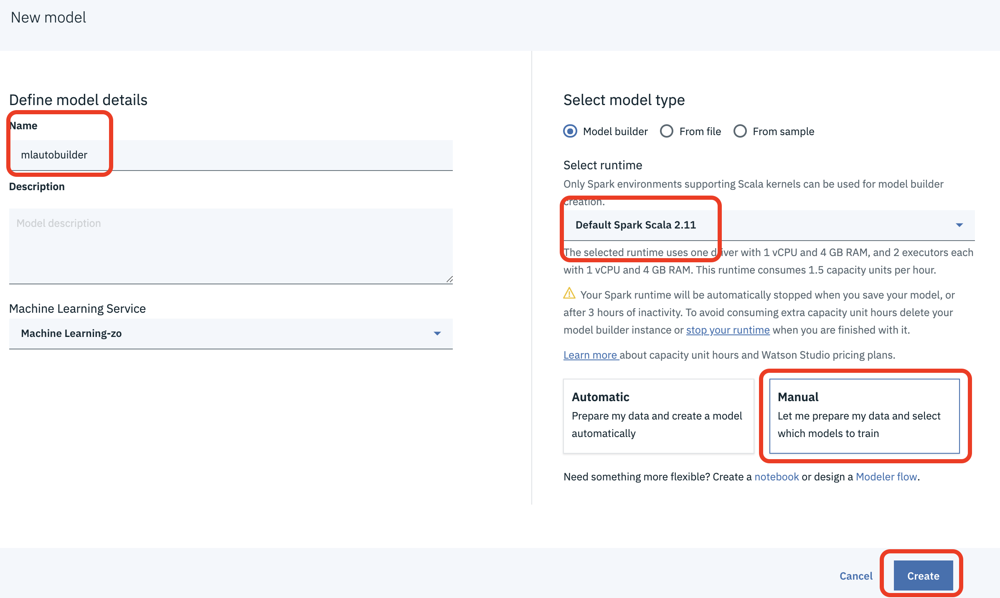
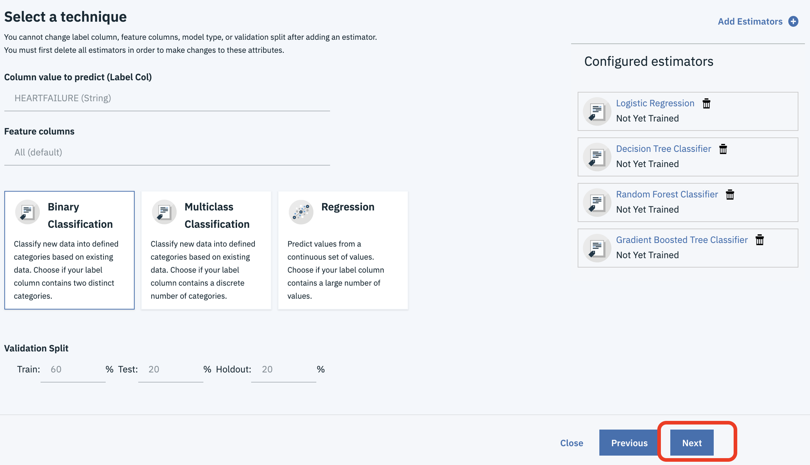

# Build and Deploy an ML model using Automated Model Builder

In this walkthrough we will be building a model. The flow of this walkthrough is:

- Create a project in Watson Studio.
- Add dataset to project.
- Use the Model Builder Wizard to build a model.
- Deploy the model to the IBM Watson Machine Learning service.

## Included components

- [IBM Watson Studio](https://www.ibm.com/cloud/watson-studio): Analyze data using RStudio, Jupyter, and Python in a configured, collaborative environment that includes IBM value-adds, such as managed Spark.

### Prerequisites

- The data and Jupyter notebooks used in these labs are contained in this repository. Ensure you have downloaded / cloned the repository per instructions in the [README](READMe.md).

- It is assumed you have your environment set up with either lite or payed versions of Watson Studio and Watson Machine Learning. If not, contact the lab instructor or set up your own lite instances as detailed in the [Setup Environment readme](EnvironmentSetup.md)

## Step 1: Setup Project

1. Open Watson Studio by logging in at [https://dataplatform.ibm.com](https://dataplatform.ibm.com)

1. From the dashboard page, Click the **`Get started`** drop down menu on the top right of the page and then Click on the **`Create a project`** option to create a new project on Watson Studio.

    

1. Select `Standard` as the type of project to create.

1. Give your project a name and click **`Create`** on the bottom right.

    

1. Next we have to associate a Watson Machine Learning service to the project. Click on `Settings` on the top banner of the project, then `Add Service` under `Associate Services` and finally, select `Watson` to add a Watson service to the project.

    

1. Select `Machine Learning` from the list of available Watson Services.

    

1. Click on the `Existing` tab and select the name of your Machine Learning service instance.

    
  
1. The Watson Machine Learning service is now listed as one of your `Associated Services`.

## Step 2: Add Data Set

1. Click the `Assets` tab of the project near the top of the page. Then click `Add to project` on the top right, selecting `Data`.

    

    A panel on the right of the screen appears, select `Load` and click on `Browse` to upload the data file you'll use to create a predictive model.

    

1. On your machine, browse to the location of the file **patientdataV6.csv** in this repository in the **data/** directory. Select the file and click on Open (or the equivalent action for your operating system). Once successfully uploaded, the file should appear in the `Data Assets` section of `Assets`.

## Step 3: Train a Machine Learning model

The Automatic Model Builder tool in Watson Studio, backed by the Watson Machine Learning Service simplifies two fundamental operations of machine learning: training and scoring.

*Training* is the process of refining an algorithm so that it can learn from a data set. The output of this operation is called a model. A model encompasses the learned coefficients of mathematical expressions.

*Scoring* is the operation of predicting an outcome by using a trained model. The output of the scoring operation is another data set containing predicted values.

Let's create a machine learning pipeline that leverages data transformations and machine learning algorithms to train several models and evaluate their accuracy; all without writing any code.

1. Starting from the `Assets` tab of you Watson Studio Project, click `Add to Project` and `Watson Machine Learning Model`

1. Within the *New Model* dialog, name the model something unique *INITIALS-Heart Failure Prediction Model-autobuilder*, select the runtime that will be used for building a data pipeline, and training.  The `Default Spark Scala 2.11` environment should be used, and will consume 1.5 capacity units per hour of training. Select `Manual` to define the evaluator algorithms, they type of model to train, and how to split training and validation data. Click `Create`, to begin training and evaluating.

    

1. Select your training dataset and click `Next`

1. Configure how the Machine Learning Model is trained, and what data is used in the training. Before moving onto the next step there are several basic machine learning terms, best practices, and conventions to understand. First it's important to understand our data, what it represents, it's format, and what we're trying to predict.  
  
    1. **Selecting a Label Column** - The Label Column is what we would like to predict. In this usecase we are trying to predict if someone is at risk of heartrate failure or not. Looking at the data from previous steps we know there's a *HEARTRATEFAILURE* column and it's represented by a string value of *Y* or *N* for each sample.  Select `HEARTRATEFAILURE`, as it's what we're trying to predict.

    1. **Selecting Feature Columns** - The Feature Column(s), are what fields in each sample are used to make a prediction. From previous steps we identified several columns in our dataset that represent different *Features* of each sample that might influence if a patient is at risk of heartrate failure. Here the Automatic Model Builder tool will default to selecting all columns, excluding the `Label Column` of `HEARTRATEFAILURE` to use in making a prediction.

    1. **Selecting Model Type** - The Automatic Model Builder simplifies *Classification* and *Regression* tasks, where *classification* builds a model to predict a discrete class, and *Regression* builds a model to predict a continious value. Since we're trying to predict either *Y* someone is at risk of heartrate failure or *N* someone is not at risk of heartrate failure we're working on a `Binary Classification` task, where the prediction can either be 0 or 1. Based on the `Label Column` selected, the Automatic Model Builder will have already selected `Binary Classification` for use in training.

    1. **Validation Split** - Training machine learning models is an iterative process and the data used to train a model should not be used when evaluating the accuracy of a model, as data used in training is already known and has shaped how the model formed. Validation of a models accuracy depends on usage of data the model has never seen before.  This step splits up all of our data setting some asside for training, test, and eventually validation. A common division of this data is usually 60% Training, 20% Test, and 20% validation.  The Automatic Model Builder has already set these defaults.

    1. **Estimators** - The machine learning algorithms used for finding the best fit of `Features` to `Label` are estimators.  These estimators are hardest part of machine learning, and finding the right one depends on the input data and type of problem, regression, classification, clustering, or dimensionality reduction. With the Automatic Model Builder we can select several different *estimators* and compare their accuracy on the problem of predicting heartrate failure. 
  
1. Click on `Add Estimators`, and select the 4 available: Logistic Regression, Decision Tree Classifier, Random Forest Classifier, Gradient Boosted Tree Classifier, then click the `Add` button.
  
1. The Automatic Model Builder is now configured and ready to run, click `Next`

    
  
1. The training of these mdoels may take some time but results will start showing on the model selection page. Evaluate the effectiveness of each model. Models are compared for accuracy by the *Area Under ROC Curve*, and the *Area under PR Curve*, where the higher the value the more accurate the model. The ROC Curve is calculated by comparing the *True Positive* rate vs the *False Positive Rate*.  The precision-recall (PR) Curve shows the tradeoff between precision and recall for different threshold. A high area under the curve represents both high recall and high precision, where high precision relates to a low false positive rate, and high recall relates to a low false negative rate. High scores for both show that the classifier is returning accurate results (high precision), as well as returning a majority of all positive results (high recall). For our task of predicting heartrate failure, we want high percision with a low false positive, false negative rate.  Unfortunally with the data we have we're about 60% accurate with high percision using a Random Forest Classifier.

1. Select the trained model that has the highest *Area Under PR Curve* and click `Save`

1. Congratulations, you've trained and evaluated a machine learning model without writing any code! **Note:** Your model will have different results and accuracy due to the randomness of spliting up the training and evaluation data.

## [Optional] Step 4: Deploy the Machine Learning model

Although training is a critical step in the machine learning process, the model still needs to be packaged, fronted with an API, and deployed as a web service. Watson Machine Learning streamlines deployment of machine learning models into production.

1. Starting from projects page in Watson Studio, you should see an additional asset has been added to the project. The newly trained and saved model you created above should be visible. One easy way to tell it was created by the automated model builder is the type will be type wml.

1. Select the model from the project view, then select `Deployments` from the model view, and finally select `Add Deployment`.

1. Name the deployment something unique and click `Save`.

1. The model is quickly packaged and deployed. Upon completion you will have a new deployment of the trained machine learning model; every trained model can have many deployments.

## [Optional] Step 5: Test the Model

1. Aside from testing the model within the notebook. You can test the model using the Watson Studio Interface.

1. Click on the `Deployment` tab on the top of the project page and then click the name you used to create the deployment of your model

   

1. Enter some values in the form and click the `Predict` button.

   
