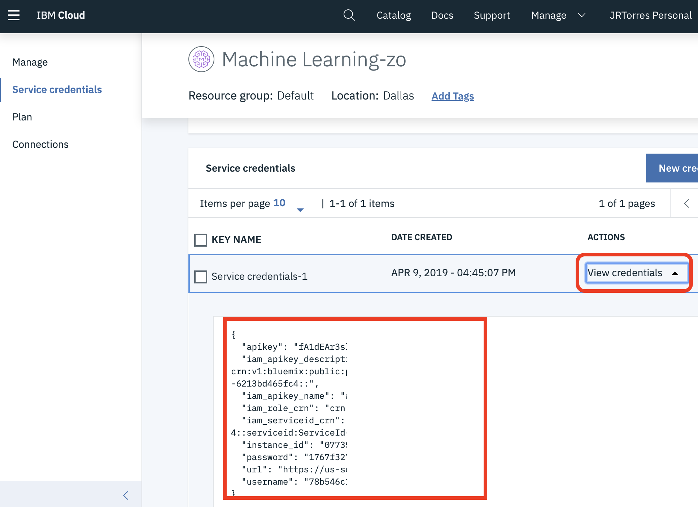
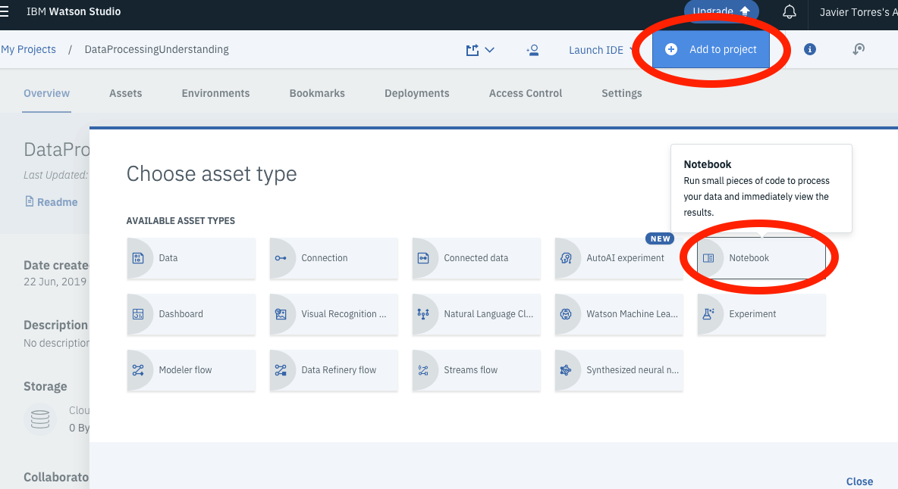
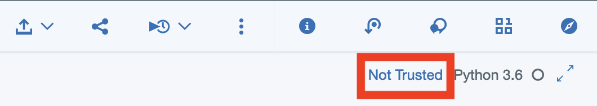
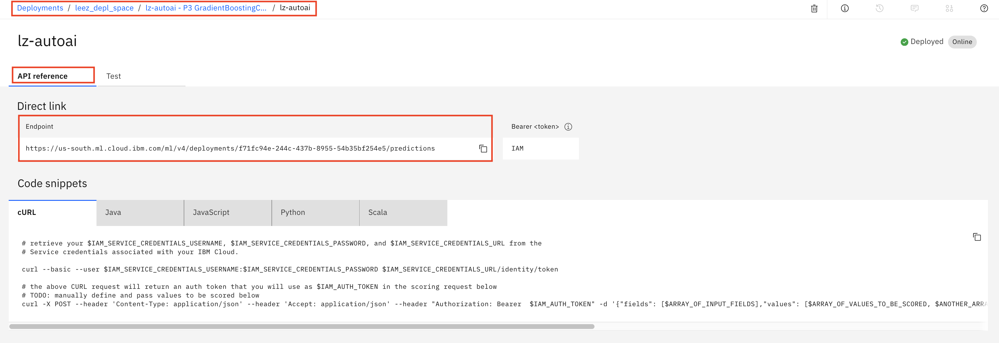
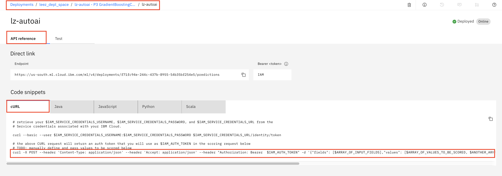

# Build and Deploy an ML model using code

In this walkthrough we will be building a model. The flow of this walkthrough is:

- Create a project and a Jupyter Notebook in Watson Studio.
- Run the notebook to build a model
- Deploy the model to the IBM Watson Machine Learning service


## Included components

- [IBM Watson Studio](https://www.ibm.com/cloud/watson-studio): Analyze data using RStudio, Jupyter, and Python in a configured, collaborative environment that includes IBM value-adds, such as managed Spark.
- [Jupyter Notebook](https://jupyter.org/): An open source web application that allows you to create and share documents that contain live code, equations, visualizations, and explanatory text.
- [PixieDust](https://github.com/pixiedust/pixiedust): Provides a Python helper library for IPython Notebook.


### Prerequisites

- The data and Jupyter notebooks used in these labs are contained in this repository. Ensure you have downloaded / cloned the repository per instructions in the [README](READMe.md).

- It is assumed you have your environment set up with either lite or payed versions of Watson Studio and Watson Machine Learning. If not, contact the lab instructor or set up your own lite instances as detailed in the [Setup Environment readme](EnvironmentSetup.md)


## Step 1: Gather WML Credentials

1. To access the Watson Machine Learning service from SDKs and within Jupyter Notebooks the service credentials are necessary.

1. To get the Watson Machine Learning service credentials from the Watson Studio page (https://dataplatform.ibm.com) click the three horizontal bars in the upper left corner and click `Watson Services`.

    

1. Click on the name of your machine learning instance in the list under "Machine Learning"

1. From within the Watson Machine Learning Service details, select `Service Credentials` from the left menu.  Click on `View Credentials` and copy the credentials for the Watson Machine Learning Service.

    


## Step 2: Setup Project and Data

1. Open Watson Studio by logging in at [https://dataplatform.ibm.com](https://dataplatform.ibm.com)

1. From the dashboard page, Click the **`Get started`** drop down menu on the top right of the page and then Click on the **`Create a project`** option to create a new project on Watson Studio.

    

1. Select option `Select an empty project`.

1. Give your project a name and click **`Create`** on the bottom right.

    

1. Next we have to associate a Watson Machine Learning service to the project. Click on `Settings` on the top banner of the project, then `Add Service` under `Associate Services` and finally, select `Watson` to add a Watson service to the project.

    

1. Select `Machine Learning` from the list of available Watson Services.

    

1. Click on the `Existing` tab and select the name of your Machine Learning service instance.

    
  
1. Click `Select`.

1. The Watson Machine Learning service is now listed as one of your `Associated Services`.


## Step 3: Add / Run Notebook

1. Click the `Assets` tab of the project near the top of the page.

1. Add a new notebook. Click `Add to project` and choose `Notebook`:

   

1. Choose new notebook `From File`. Give your notebook a name and choose the notebook file from the downloaded repository (`intro-machine-learning/notebooks/sparkmodel.ipynb`).

1. For `Runtime`, be sure to select the one starting with `Default Spark Python 3.6`, then click `Create Notebook`.

   

1. After a few seconds the notebook should be loaded.

1. If you see `Not Trusted` on the top-right corner of your screen, click on it. 

    

1. When prompted, choose `Trust`.

1. After a few seconds, the notebook becomes `Trusted`.

1. Follow the instructions in the notebook to complete the exercise. Click the `(►) Run` button to start stepping through the notebook. 

>> **Important** when the code in a cell is still running, the label to the left changes to **In [\*]**. Do **not** continue to the next cell until the code is finished running.


## [Optional] Step 4: Test the Model

Aside from testing the model within the notebook. You can test the model using the Watson Studio Interface.

1. Navigate to the home page of your project in Watson Studio.

1. Click on the `Deployment` tab on the top of the project page and then click the name you used to create the deployment of your model

   

1. Navigate to the `Test` tab.
   
   

1. Enter testing values below in the form and click the `Predict` button.

    ```
    AVGHEARTBEATSPERMIN:        93
    PALPITATIONSPERDAY:         22
    CHOLESTEROL:                163
    BMI:                        25
    AGE:                        49
    SEX:                        F
    FAMILYHISTORY:              N
    SMOKERLAST5YRS:             N
    EXERCISEMINPERWEEK:         110
    ```


## [Optional] Step 5: Test the Model Rest API via Node.js Sampe Code

You complete the steps in this section in a `IBM Cloud Shell` environment in IBM Cloud. 

1. Prepare a `IBM Cloud Shell` environment. `IBM Cloud Shell` environment provides all required CLI tools for the exercise.

    - Login to [IBM Cloud](https://cloud.ibm.com)(https://cloud.ibm.com).
    - Open [`IBM Cloud Shell`](https://cloud.ibm.com/shell)(https://cloud.ibm.com/shell).

    Alternatively, you may use any terminal environment. But, `IBM Cloud Shell` environment provides all required CLI tools.

1. Clone the ML repository.

    ```
    cd ~
    git clone https://github.com/lee-zhg/intro-machine-learning.git
    cd  intro-machine-learning
    ```

1. Watson Machine Learning REST API requests an access token for authentication. In order to get access token you need to have API Key that you can get from your IBM cloud account. To obtain a API key,

        ```
        ibmcloud iam api-key-create <key name>
        ```

1. Open the Node.js application `app.js` in a file editor. File `app.js` can be found in the root folder of the downloaded repository.

    ```
    vi app.js
    ```

1. Replace `apikey` in the code with the one that you created in the previous step.

    ```
    // Paste your apikey here
    const apikey = "ABC";
    ```

1. Retrieve the `Scoring Endpoint` of your ML model.

    The complete navigation path shows below.
    * Navigate to the home page of your Watson Studio at https://dataplatform.cloud.ibm.com/home2?context=cpdaas.
    * Select `Deployment spaces`.
    * Select your deployment space.
    * Navigate to the `Deployments` tab.
    * Select your deployment.

   

1. Replace `scoring_url` in the `app.js` code with your `Scoring Endpoint`.

    ```
    const scoring_url = "https://us-south.ml.cloud.ibm.com/ml/v4/deployments/f71fc94e-244c-437b-8955-54b35bf254e5/predictions";
    ```

1. Append `?version=2020-09-01` to the end of `scoring_url`. After modification, the `scoring_url` should look like

    ```
    const scoring_url = "https://us-south.ml.cloud.ibm.com/ml/v4/deployments/f71fc94e-244c-437b-8955-54b35bf254e5/predictions?version=2020-09-01";
    ```

1. Execute command below to install required Node.js libraries.

    ```
    npm install
    ```

1. Execute command below to run the Node.js sample code which calls your model Rest API and make prediction.

    ```
    node app.js
    ```

1. You should receive a prediction.

    ```
    Scoring:
    {
        "predictions": [{
            "fields": ["prediction", "probability"],
            "values": [["N", [0.9160491065327744, 0.08395089346722558]]]
        }]
    }
    ```       


## [Optional] Step 6: Test the Model Rest API via Curl Commands

Alternatively, you can also test the model REST API via external applications. Watson Machine Learning supports REST API in multiple languages. One way to invoke the model API is using the cURL command.

1. In your browser, navigate to the `API reference` tab.

   

    If you can't find the above page for any reason, a complete navigation path shows below
    * Navigate to the home page of your Watson Studio at https://dataplatform.cloud.ibm.com/home2?context=cpdaas.
    * Select `Deployment spaces`.
    * Select your deployment space.
    * Navigate to the `Deployments` tab.
    * Select your deployment.

1. Copy and paste the last command to a pure text editor. THis is a sample CURL command for accessing your deployed model. For example,

    ```
    curl -X POST --header 'Content-Type: application/json' --header 'Accept: application/json' --header "Authorization: Bearer  $IAM_AUTH_TOKEN" -d '{"fields": [$ARRAY_OF_INPUT_FIELDS],"values": [$ARRAY_OF_VALUES_TO_BE_SCORED, $ANOTHER_ARRAY_OF_VALUES_TO_BE_SCORED]}' https://us-south.ml.cloud.ibm.com/ml/v4/deployments/f71fc94e-244c-437b-8955-54b35bf254e5/predictions
    ```

    >Note: avoid to use any file editor that automatically formats the file contents.

1. Modify the sample CURL command.

    * Replace `{"fields": [$ARRAY_OF_INPUT_FIELDS],"values": [$ARRAY_OF_VALUES_TO_BE_SCORED, $ANOTHER_ARRAY_OF_VALUES_TO_BE_SCORED]}` with `"$ML_PAYLOAD"`.
    * Append `?version=2020-09-01` to the url at the end of command `https://us-south.ml.cloud.ibm.com/ml/v4/deployments/f71fc94e-244c-437b-8955-54b35bf254e5/predictions`.
    * Add `'` at the begining and the end of the new url.

1. After modification, the sample CURL command should look like

    ```
    curl -X POST --header 'Content-Type: application/json' --header 'Accept: application/json' --header "Authorization: Bearer  $IAM_AUTH_TOKEN" -d "$ML_PAYLOAD" 'https://us-south.ml.cloud.ibm.com/ml/v4/deployments/f71fc94e-244c-437b-8955-54b35bf254e5/predictions?version=2020-09-01'
    ```

1. You are not ready to reach your deployed model via API yet. You need couple of items
    * take care of authentication
    * populate the `ML_PAYLOAD`

1. ML REST API requests an access token for authentication. In order to get access token you need to have API Key that you can get from your IBM cloud account. To obtain a API key,

    - Login to [IBM Cloud](https://cloud.ibm.com)(https://cloud.ibm.com).
    - Open [`IBM Cloud Shell`](https://cloud.ibm.com/shell)(https://cloud.ibm.com/shell).
    - Get an API key by running the command below.

        ```
        ibmcloud iam api-key-create <key name>
        ```
1. Below is a sample output of the above command.

    ```
    OK
    API key my-api-key was created

    Please preserve the API key! It cannot be retrieved after it's created.
                    
    ID            ApiKey-3c129f63-cdfc-42ea-959e-a6cb8d25e31c   
    Name          my-api-key   
    Description      
    Created At    2020-10-08T13:57+0000   
    API Key       zcV7hlx4LSyL6Ca7eMXRFF0SxbvyuaXh64NcuYtAW-GfdhP   
    Locked        false   
    ```

1. Store the API key in an environment variable `API_KEY`.

    ```
    export API_KEY=zcV7hlx4LSyL6Ca7eMXRFF0SxbvyuaXh64NcuYtAW-GfdhP
    ```

1. In the `IBM Cloud Shell`, execute the command below to retrieve an access token for accessing the Machine Learning Instance.

    ```
    curl -k -X POST \
        --header "Content-Type: application/x-www-form-urlencoded" \
        --header "Accept: application/json" \
        --data-urlencode "grant_type=urn:ibm:params:oauth:grant-type:apikey" \
        --data-urlencode "apikey=$API_KEY" \
        "https://iam.cloud.ibm.com/identity/token"
    ```

1. The output of the above command looks like

    ```
    {
        "access_token":"eyJraWQiOiIyMDE5MDcyNCIsImFsZyI6IlJTMjU2In0.eyJpYW1faWQiOiJpYW0tU2VydmljZUlkLWE5MWNmZjllLTkwZGYtNDQwYy04NTFkLWNjYTRjMmI2ODk3MyIsImlkIjoiaWFtLVNlcnZpY2VJZC1hOTFjZmY5ZS05MGRmLTQ0MGMtODUxZC1jY2E0YzJiNjg5NzMiLCJyZWFsbWlkIjoiaWFtIiwiaWRlbnRpZmllciI6IlNlcnZpY2VJZC1hOTFjZmY5ZS05MGRmLTQ0MGMtODUxZC1jY2E0YzJiNjg5NzMiLCJzdWIiOiJTZXJ2aWNlSWQtYTkxY2ZmOWUtOTBkZi00NDBjLTg1MWQtY2NhNGMyYjY4OTczIiwic3ViX3R5cGUiOiJTZXJ2aWNlSWQiLCJhY2NvdW50Ijp7InZhbGlkIjp0cnVlLCJic3MiOiIzOGM4MTVjZGZmNWQ0YWQzOTdmYmY1NzYxMzMwNWY4OCJ9LCJpYXQiOjE1NzM2NDU2NTQsImV4cCI6MTU3MzY0OTI1NCwiaXNzIjoiaHR0cHM6Ly9pYW0uY2xvdWQuaWJtLmNvbS9pZGVudGl0eSIsImdyYW50X3R5cGUiOiJ1cm46aWJtOnBhcmFtczpvYXV0aDpncmFudC10eXBlOmFwaWtleSIsInNjb3BlIjoiaWJtIG9wZW5pZCIsImNsaWVudF9pZCI6ImRlZmF1bHQiLCJhY3IiOjEsImFtciI6WyJwd2QiXX0.lu3sZfMINL7CV3YiyyqNVw9bx-OeQpNjGknXjc8fFgb-wug4V6Up1tdFnGROfGPx7YNBzocKrocHpDokAD-sewltgC0vibchynEuMCDjale-KpCfpAt2-8lMb-JvvEid_RAlhCBxLq9cGGopLPBT6tUGntkj2VisF1NLYGAew9wnrVMlOvl-6xOiTjwBMPmVlzN0ZADabPGIjVDLNByO_b9E_LJm3xCtfoUbLu_2Ng8DUGHn1btJToGDEYLyBnpvjdXiptdb3hHjV2VmGSlyQbmyqtlhFwByT3ifXbB0VyxfhoCF_57PrTEYxa1DPoloIcSSv1I6HHMejhC7uM84Tw",
        "refresh_token":"ReWaOOr5mTk7vdL5tAZKkyvvJJkwHtF-an8qXXwO30cGWPw8Yh3X3N-aj9MaNyfLnCRj6czosx5iz6gGXWL5W3rE_tk8MA1lpMMLthcgbfcF8YUXh_p9WuSyJjcjQBA0WEgDfy_EnNUsopxJ45pyix-GO3sMEAWWLUk-LYv4bsIlu-envUjk-IBrFmr74_fSf9i8OlwQcZ69O1Dr1C_wEELnDApjLJ5IMIfsXGSAH3YYUxvAX32gcwt2zqjXzK6jtb5M7YZ1d37ODWfAn3jZZWcWxqYXj8XAiD6cQsro31BXjs515q0UAW0bmHHbhW3nbayM1WuXbP92OZh9SaOBDW3STJqPAgEPwqtSt30kP60WKwyPOC3oLBmvv_jIV5Tu1ux0W1wxLr6P6cG4CU4u8TC-6ZSYKfF-rHAc30f2vj0KZrNGXpZ5kySDOwvTxMWGWn0RHB4Qs94NT2DmvDNTFMQdzEgAOpkb_ASJMJDfjnHuEQA96YXyajTTlZKADkhvTScA_KGa70VSttpEjBbPxV8cFSnAnp2cVK8k4srSb5KK-KSnSDoZftQ7pWc8a15T43LHH8lE-3q_Rd2EINUjTON4F19N3PNAbGbg4zoTp42i5C4l4GY5uTpY1zlj4EoKwv9qmWBFo3qnrsdrDeikM_cLLVuD4I_c2ViCn_X37xHrQSrM1FVAKC-DfmMEJXDvrtt-6cjtzLiRgoAtFVftMRJREtxAB5i9iU58AystKhzj9aVtXT3drndQt3WJ7C1dqh9f-9nTSReJEKil2DmYB7sO_vXhDOGFWBMDFesp3rjgMix99pXIn9OfhhiUxntvnGgojHR4Q1pvBedmMouliu3SknF0L83bW5ungCqzi-46FOol3dhlV4oej4ZKZfLJSuUMrBcVvzZte3yxMAnihKdERiCsnlieWNjUhC_Las3spWmr6pG9ryYPTkqESAmKkRX66LpCPa7RYv1V4cQ4_o-xf6DKM6Yb-l3ue1gGoZN8OIzCP5NY0i1JeSY4fcoDqGLT9nqwNBACrkmYnaWATPasPG0ym9tyejh8t_FjsUNiUA",
        "token_type":"Bearer",
        "expires_in":3600,
        "expiration":1573649254,
        "scope":"ibm openid"
    }
    ```

    > Note, online JSON formatter tool can be helpful for a better output format. For example, https://jsonformatter.org/.

1. Store the `access_token` of the above output without surrounding`"` in an environment variable `IAM_AUTH_TOKEN`. 

    ```
    export IAM_AUTH_TOKEN=eyJraWQiOiIyMDE5MDcyNCIsImFsZyI6IlJTMjU2In0.eyJpYW1faWQiOiJpYW0tU2VydmljZUlkLWE5MWNmZjllLTkwZGYtNDQwYy04NTFkLWNjYTRjMmI2ODk3MyIsImlkIjoiaWFtLVNlcnZpY2VJZC1hOTFjZmY5ZS05MGRmLTQ0MGMtODUxZC1jY2E0YzJiNjg5NzMiLCJyZWFsbWlkIjoiaWFtIiwiaWRlbnRpZmllciI6IlNlcnZpY2VJZC1hOTFjZmY5ZS05MGRmLTQ0MGMtODUxZC1jY2E0YzJiNjg5NzMiLCJzdWIiOiJTZXJ2aWNlSWQtYTkxY2ZmOWUtOTBkZi00NDBjLTg1MWQtY2NhNGMyYjY4OTczIiwic3ViX3R5cGUiOiJTZXJ2aWNlSWQiLCJhY2NvdW50Ijp7InZhbGlkIjp0cnVlLCJic3MiOiIzOGM4MTVjZGZmNWQ0YWQzOTdmYmY1NzYxMzMwNWY4OCJ9LCJpYXQiOjE1NzM2NDU2NTQsImV4cCI6MTU3MzY0OTI1NCwiaXNzIjoiaHR0cHM6Ly9pYW0uY2xvdWQuaWJtLmNvbS9pZGVudGl0eSIsImdyYW50X3R5cGUiOiJ1cm46aWJtOnBhcmFtczpvYXV0aDpncmFudC10eXBlOmFwaWtleSIsInNjb3BlIjoiaWJtIG9wZW5pZCIsImNsaWVudF9pZCI6ImRlZmF1bHQiLCJhY3IiOjEsImFtciI6WyJwd2QiXX0.lu3sZfMINL7CV3YiyyqNVw9bx-OeQpNjGknXjc8fFgb-wug4V6Up1tdFnGROfGPx7YNBzocKrocHpDokAD-sewltgC0vibchynEuMCDjale-KpCfpAt2-8lMb-JvvEid_RAlhCBxLq9cGGopLPBT6tUGntkj2VisF1NLYGAew9wnrVMlOvl-6xOiTjwBMPmVlzN0ZADabPGIjVDLNByO_b9E_LJm3xCtfoUbLu_2Ng8DUGHn1btJToGDEYLyBnpvjdXiptdb3hHjV2VmGSlyQbmyqtlhFwByT3ifXbB0VyxfhoCF_57PrTEYxa1DPoloIcSSv1I6HHMejhC7uM84Tw
    ```

1. In the `IBM Cloud Shell`, define the sample payload and store it in an environment variable `ML_PAYLOAD`. 

    ```
    export ML_PAYLOAD='{"input_data": [{"fields": ["AVGHEARTBEATSPERMIN", "PALPITATIONSPERDAY", "CHOLESTEROL", "BMI", "AGE", "SEX", "FAMILYHISTORY", "SMOKERLAST5YRS", "EXERCISEMINPERWEEK"],"values": [[93, 22, 163, 25, 49, "F", "N", "N", 110]]}]}'
    ```

1. Now, you are ready to reach the deployed model via API. 

1. In the `IBM Cloud Shell`, execute the CURL command that you prepared in the previous steps.

    ```
    curl -X POST --header 'Content-Type: application/json' --header 'Accept: application/json' --header "Authorization: Bearer  $IAM_AUTH_TOKEN" -d "$ML_PAYLOAD" 'https://us-south.ml.cloud.ibm.com/ml/v4/deployments/f71fc94e-244c-437b-8955-54b35bf254e5/predictions?version=2020-09-01'
    ```

1. The command should return something similar to 

        ```
        {
            "predictions": [{
                "fields": ["prediction", "probability"],
                "values": [["N", [0.9131566364079782, 0.08684336359202187]]]
            }]
        }
        ```

    * When calling the REST API of your deployed model in IBM Cloud with the sample input data, the prediction of the heart failure is `false` with `91.3%` of certainty.

    > Note, the access token expires after a while. If you received error `405: Method Not Allowed`, regenerate the access token and refresh the environment variable `IAM_AUTH_TOKEN`, then run the CURL command again.