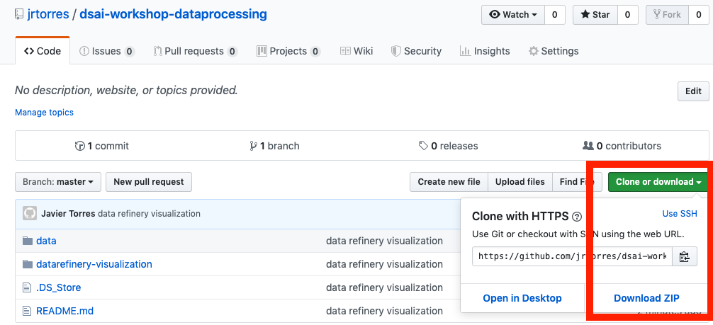

# Data & AI Workshop - Machine Learning


## Objective

This workshop will walk you through model development stages of the Data Science / ML workflow. We will be exploring different ways to build machine learning models and deploying those models. By the end of these labs/tutorials, you should understand:

- The use of Jupyter Notebooks in IBM Watson Studio
- Code based approaches to building ML models
- Low-code and Zero code based approached to building ML Models
- Deploying ML models to Watson Machine Learning.


### Tools Used

- Watson Studio [(docs)](https://dataplatform.cloud.ibm.com/docs/content/wsj/getting-started/welcome-main.html?audience=wdp)
- Watson Machine Learning [(docs)](https://developer.ibm.com/clouddataservices/docs/ibm-watson-machine-learning/get-started/)
- [Jupyter Notebooks](http://jupyter.org/)
- [Scikit Learn](https://scikit-learn.org/)
- Several Python Libraries: Pandas, Seaborn, Matplotlib, [PixieDust](https://github.com/pixiedust/pixiedust)


## Requirements

- [IBM Cloud Account](https://cloud.ibm.com)

***


## Workshop Flow

Most of these labs are written in python and using Jupyter Notebooks. One of the most common python libraries used for data analysis and manipulation is [pandas](https://pandas.pydata.org/), which is used throughout the labs. For a quick tutorial around pandas, feel free to run through the material found here - [IBMDeveloperUK pandas-workshop](https://github.com/IBMDeveloperUK/pandas-workshop).


### Prerequisites

1. Store this repository on your local computer.

   If you have GIT on your machine, clone this repository locally. Open a terminal and run:

   ```
   $ git clone https://github.com/lee-zhg/intro-machine-learning.git
   ```

   If you do NOT have GIT on your machine, you can just download the repository as a ZIP file. In the browser window, select :

    

1. Ensure you have access to a Waston Studio Instance. If you need to provision an instance, see the instructions in the [Setup Watson Studio doc](EnvironmentSetup.md)


### Lab 1 - Building A Machine Learning Model Using Code

In this first lab, we will explore the traditional approaching to building models in code, using Python and Spark as our implementation of choice. Follow the instructions in the [Readme for code based approach](ModelBuild-Code.md)


### Lab 2 - Building A Machine Learning Model Using AutoAI

Finally, in this lab, we will explore an approach to building models that uses Watson Studio to optimize the pipeline process. Instead of selecting configuration options as we did in Lab 3, we simply select what kind of model output we are looking for and AutoAI does the rest. Follow the instructions in the [Readme for AutoAI approach](ModelBuild-AutoAI.md)


## Related Links

There is lots of great information, tutorials, articles, etc on the [IBM Developer site](https://developer.ibm.com) as well as broader web. Here are a subset of good examples related to data understanding, visualization and processing:

- [Build ML Model for Loan Eligibility using Modeler](https://developer.ibm.com/tutorials/predict-loan-eligibility-using-jupyter-notebook-ibm-spss-modeler/)
- [Build ML Model to predict Chuurn](https://developer.ibm.com/patterns/predict-customer-churn-using-watson-studio-and-jupyter-notebooks/)
- [Predict Fraud with Skewed Data](https://developer.ibm.com/patterns/predicting-fraud-using-skewed-data/)
- [XGBoost Model on Client Purchases](https://developer.ibm.com/patterns/analyze-bank-marketing-data-using-xgboost-gain-insights-client-purchases/)
- [ML Model on Medical Data](https://developer.ibm.com/patterns/analyze-open-medical-data-sets-to-gain-insights/)


## General Links

- [IBM Developer](https://developer.ibm.com)
- [Watson Studio](https://dataplatform.ibm.com/)
- [Watson Studio Overview](https://dataplatform.cloud.ibm.com/docs/content/wsj/getting-started/overview-ws.html?audience=wdp&context=wdp&linkInPage=true)
- [Watson Machine Learning Python SDK](https://wml-api-pyclient.mybluemix.net/)
- [Watson Studio Video Learning Center](https://www.youtube.com/playlist?list=PLzpeuWUENMK3u3j_hffhNZX3-Jkht3N6V)
- [Data Science Code Patterns](https://developer.ibm.com/code/technologies/data-science/)
